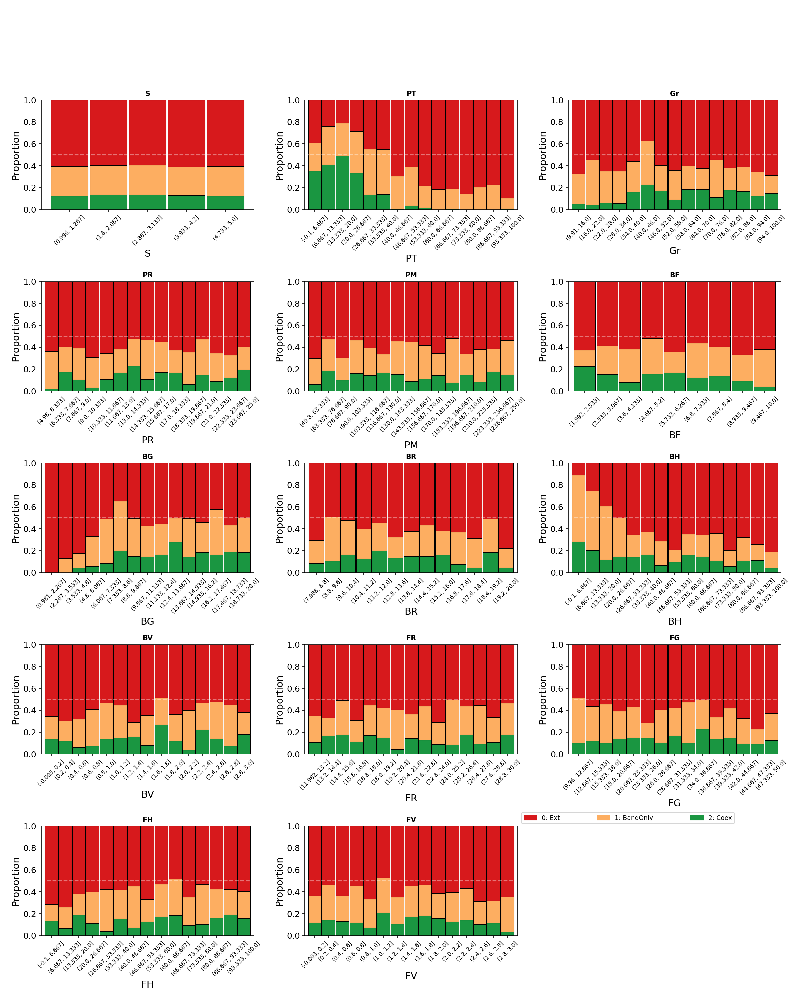
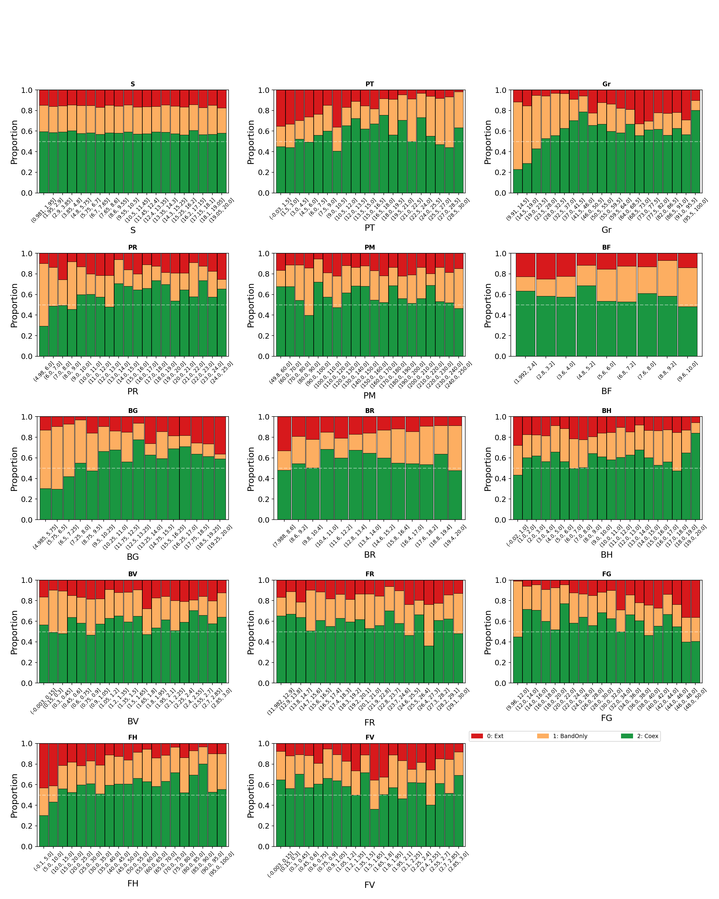
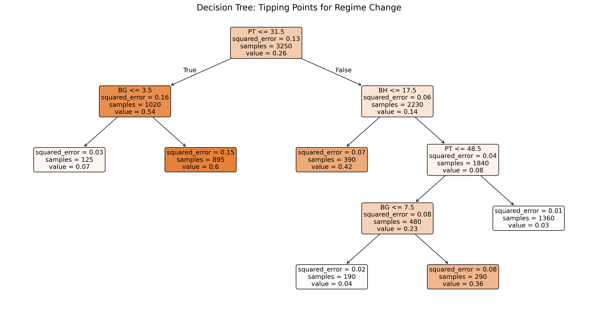
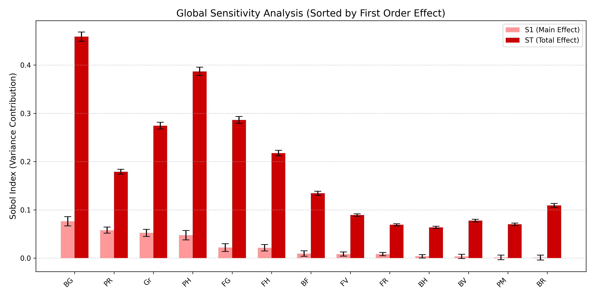
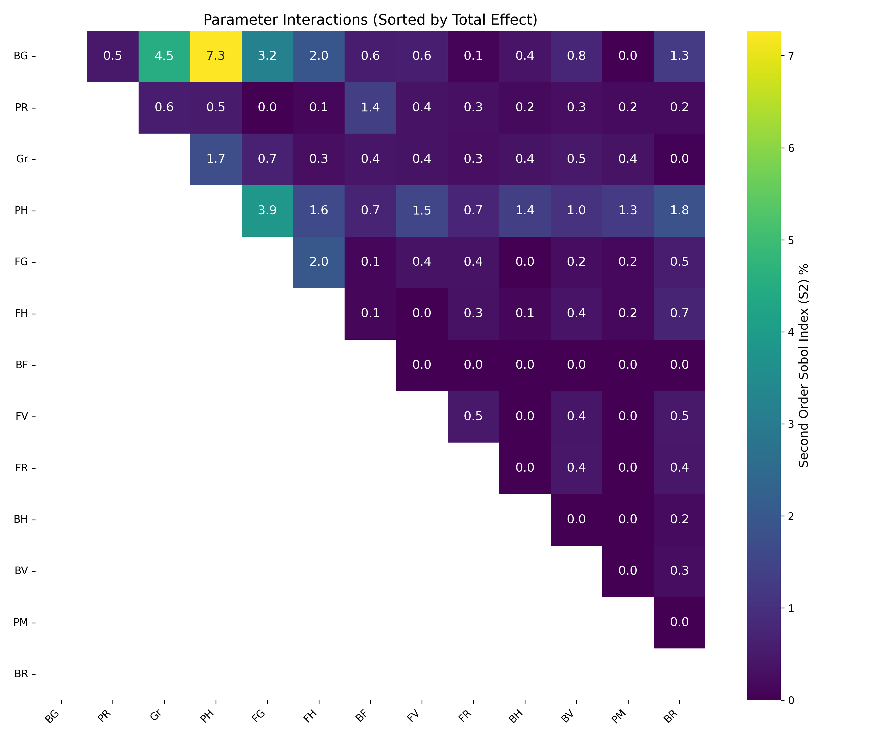

# From Model-Based to Data-Driven: Automated Exploration of Agent-Based Simulations

**Authors:** Paul Saves, Matthieu Mastio, Nicolas Verstaevel, Benoit Gaudou  
**Institute:** IRIT, Université Toulouse Capitole, Toulouse, France  
**Conference:** [MABS 2026](https://mabsworkshop.github.io/) (Multi-Agent Based Simulation)

This repository contains the source code, simulation data, and analysis scripts associated with the paper **"From Model-Based to Data-Driven: A Multi-Stage Pipeline for Automated Exploration of Agent-Based Simulations"**.

## 📌 Overview

This project presents a methodological pipeline to explore high-dimensional, stochastic Agent-Based Models (ABMs). We use a spatially explicit **Prey-Predator** model (Bandicoots & Foxes) with renewable resources to demonstrate how to transition from classical sensitivity analysis to robust surrogate modeling.

**Key Features:**
* **Agent-Based Model (NetLogo):** A tri-trophic system with spatial heterogeneity, perception-driven movement, and hunting zones.
* **Experimental Design:** Latin Hypercube Sampling (LHS) of 13 parameters with 5 stochastic replications ($N=3,250$ runs).
* **Model-Based Analysis:** Automated ANOVA and Decision Trees to identify tipping points (e.g., trap density thresholds).
* **Data-Driven Surrogate:** A machine learning pipeline (MLP, Random Forest) that predicts regime stability (Extinction vs. Coexistence) with uncertainty quantification.

## 📂 Repository Structure

```plaintext
MABS2026_Preys_Predators/
├── Scripts_to_launch_experiments/  # Scripts to run the NetLogo model (OpenMOLE/Python)
├── post_procs/                     # Analysis scripts (Surrogate Modeling, ANOVA, Visualization)
├── figures/                        # All figures present in the paper or supplementary materials
├── results_v1/                     # Raw simulation output (CSV files) - Initial Batch
├── results_v2/                     # Refined simulation output - Secondary Batch
├── LICENSE                         # BSD-3-Clause License
└── README.md                       # Project documentation
```
## 📊 Figures & Results

All figures generated from our experiments are organized by the analytical phase described in the paper.


### 1. Global Regime Dynamics
The ecosystem exhibits distinct stability regimes driven by the interplay of predator-prey density and resource availability. We compare the initial exploration (v1) with the refined sampling (v2).

| Initial Batch (v1) | Refined Batch (v2) |
|:---:|:---:|
|  |  |

* **Figure 1:** Distribution of simulation outcomes (Extinction, Oscillation, Coexistence).
    * **Left (v1):** Initial LHS exploration ($N=3,250$).
    * **Right (v2):** Refined sampling ($N=13,000$) with a focused parameter range. The dominance of the Extinction regime (gray) highlights the system's vulnerability to specific parameter combinations.
---

### 2. Model-Based Exploration (Phase 1)
Initial screening using decision trees to identify primary tipping points.


* **Figure 2:** A Decision Tree (CART) trained on the initial batch. It identifies the primary anthropogenic tipping point: when the **Proportion of Hunting Zones (PH)** exceeds $\approx 31\%$, the system shifts deterministically toward extinction.

---

### 3. Global Sensitivity Analysis (Phase 2)
Sobol' sensitivity analysis reveals that while linear models emphasize predation, non-linear models identify metabolic constraints as the true drivers.



* **Figure 3:** * **Top:** Sobol' Indices (First vs Total). Bandicoot Energy Gain ($BG$) and Grassland ($Gr$) emerge as dominant drivers when non-linearities are accounted for.
    * **Bottom:** Interaction Heatmap revealing strong coupling between prey metabolism ($BG$) and environmental capacity ($Gr$).

---

### 4. Explainability & Uncertainty Quantification
We use Partial Dependence Plots (PDP) to visualize trends and a Dual-Random Forest to map stability zones.


* **Figure 4:**
    * **Top (PDP/ICE):** The coloring by $BG$ reveals a **"Metabolic Trap"**: increasing grass has zero effect on survival if energy gain is low (blue lines), but triggers a sharp transition to coexistence if energy gain is high (red lines).
    * **Bottom (Uncertainty):** Maps the Euclidean sum of Aleatoric and Epistemic uncertainty ($\sigma_{total}$). The peaks (humps) precisely identify **Phase Transition Zones** where the ecosystem is structurally unstable and highly sensitive to stochastic initial conditions.


## ⚙️ Installation

To reproduce the analysis, you will need Python 3.9+ and the following libraries:
Bash

pip install pandas numpy scikit-learn scipy matplotlib seaborn tqdm

Note: To run new simulations, you will need NetLogo 6.x installed on your machine.

# 🚀 Usage
1. The Simulation Model

The core ABM is a NetLogo model simulating Bandicoots (Prey) and Foxes (Predators) in a heterogeneous landscape.

    Location: Scripts_to_launch_experiments/

    Inputs: 13 parameters (Metabolism, Perception radius, Hunting quotas, etc.)

    Outputs: Regime stability (0: Extinction, 1: Unstable, 2: Coexistence).

2. Data Analysis & Surrogate Modeling

The analysis pipeline is located in post_procs/. It follows the multi-stage approach described in the paper:
Step A: Preprocessing & Aggregation

We address stochasticity by aggregating the 5 random seeds per configuration. The script calculates the median outcome to filter out aleatoric noise.
Python

# Example logic found in post_procs/
df_agg = df.groupby(feature_cols)[target_col].median().reset_index()

Step B: Surrogate Training (MLP / Random Forest)

We train a surrogate model to predict the system's regime based on input parameters.

    Split: Stratified Group K-Fold (5 folds) or Leave-One-Group-Out (LOGO) to prevent data leakage between seeds.

    Models: Multi-Layer Perceptron (MLP) and Random Forest classifiers.

To run the analysis:
Bash

python post_procs/run_surrogate_pipeline.py

(Note: Replace run_surrogate_pipeline.py with the actual script name in your post_procs folder).

## 📊 Key Results

The pipeline reveals that the system is governed by sharp phase transitions rather than smooth gradients.

    Aleatoric Uncertainty: The theoretical maximum accuracy (Bayes Error Rate) is ~95.3% due to stochastic noise in the simulation.

    Surrogate Performance:

        Raw Accuracy: ~66-70% (predicting individual simulation runs).

        Aggregated Accuracy: ~82% (predicting the median regime of a parameter set).

    Drivers: The proportion of hunting zones (PH) is the dominant factor, with a critical tipping point at 31%.

## 📝 Citation

If you use this code or data in your research, please cite the MABS 2026 paper:
```
@inproceedings{saves2026mabs,
  title={From Model-Based to Data-Driven: A Multi-Stage Pipeline for Automated Exploration of Agent-Based Simulations},
  author={Saves, Paul and Mastio, Matthieu and Verstaevel, Nicolas and Gaudou, Benoit},
  booktitle={Multi-Agent Based Simulation (MABS 2026)},
  year={2026},
  publisher={Springer}
}
```

## 📄 License

This project is licensed under the BSD-3-Clause License. See the LICENSE file for details.

Contact: Pau Saves - paul.saves@irit.fr

IRIT - Institut de Recherche en Informatique de Toulouse
